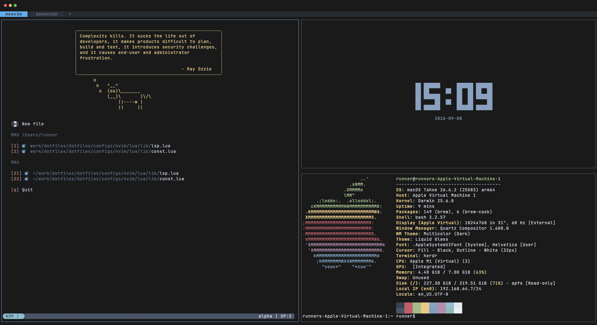

# Dotfiles

A cross-platform, modular dotfiles for my personal setup

Looking to use my dotfiles installer for your setup? Check out [installer](https://github.com/spywhere/dotfiles/tree/installer) branch.



_Recorded by CI from this repository, on every change — this is the actual setup running, not a prerecorded clip. If it looks broken here, it is broken._

## Build Status

[](https://github.com/spywhere/dotfiles/actions/workflows/macos-test.yml)
[](https://github.com/spywhere/dotfiles/actions/workflows/os-test.yml)

[](https://github.com/spywhere/dotfiles/actions)

## Quick Installation

```sh
sh -c "$(curl -sSL dotfiles.spywhere.me)"
```

## Installation with Additional Flags and Options

To use flags in remote installation, use this command

```sh
sh -c "$(curl -sSL dotfiles.spywhere.me)" - [flags...]
```
